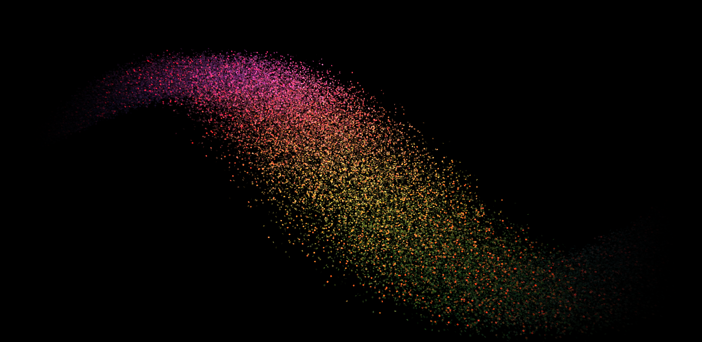
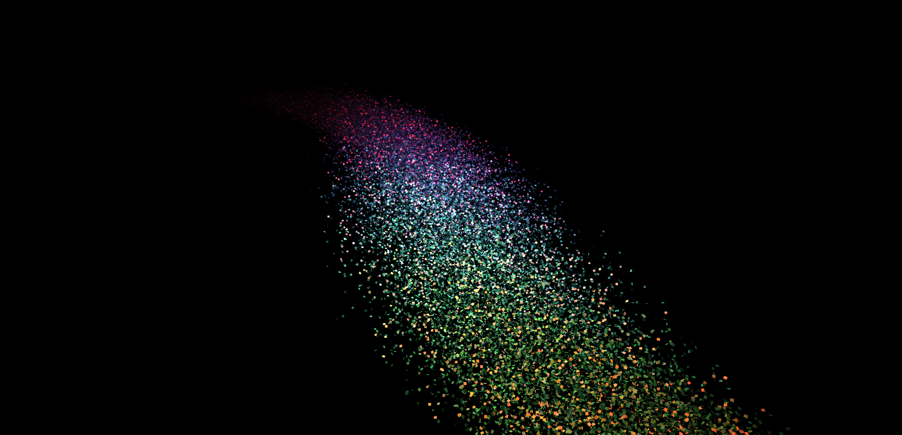
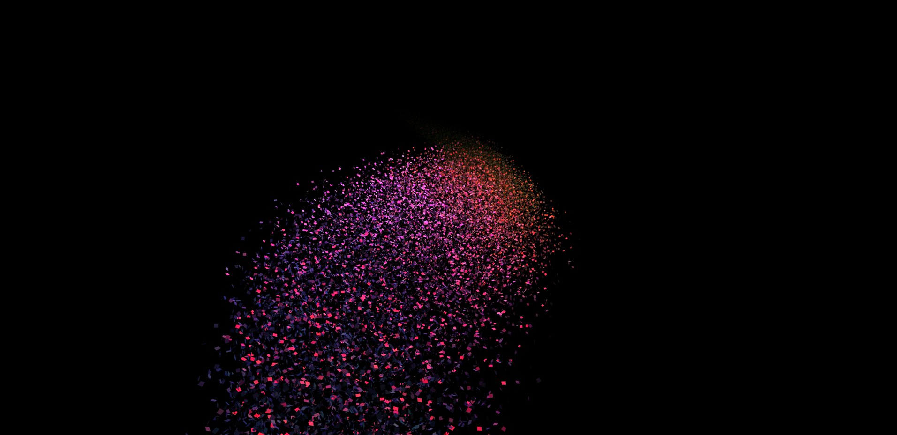
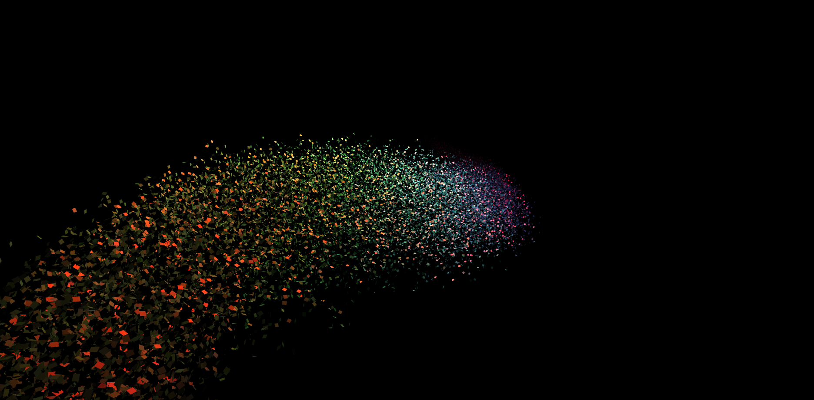
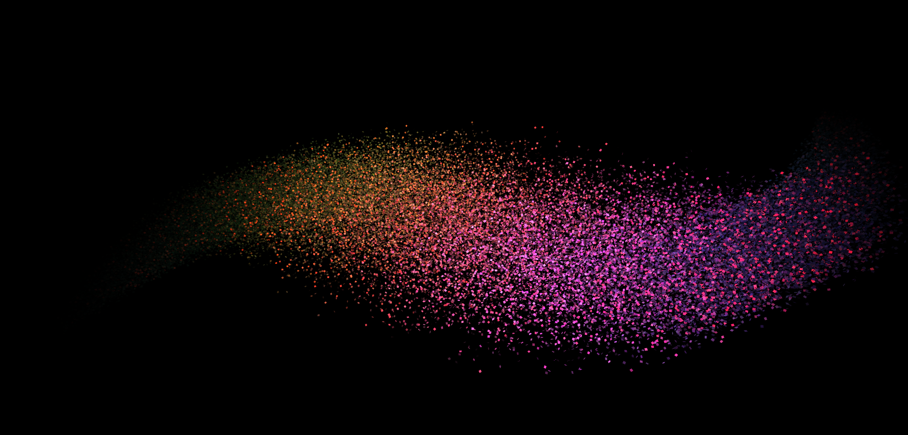

# THREE.js particle stream
Stream1                     |  Stream2                  |  Stream3
:--------------------------:|:-------------------------:|:-------------------------:
  |  | 

Stream4                     |   Stream5
:--------------------------:|:-------------------------:
  |  